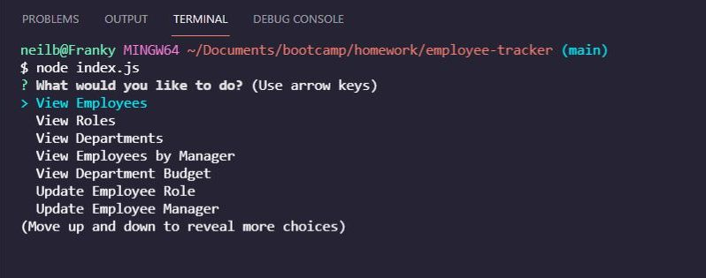
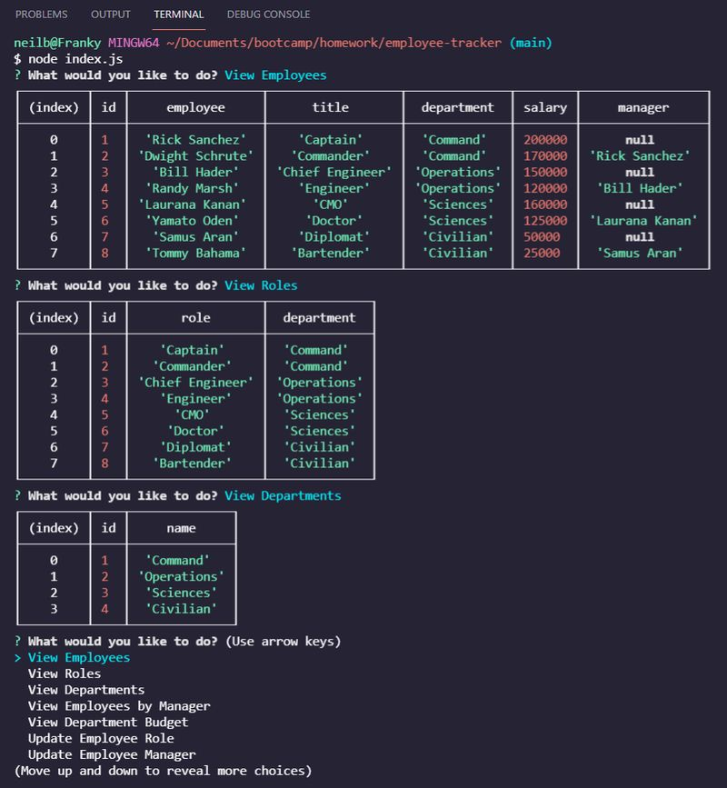
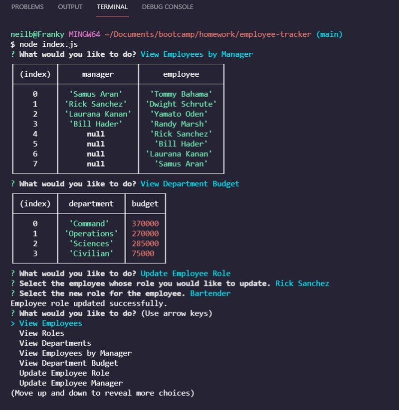

# Employee Tracker  

## Description  

This command line-based Node.js app allows the user to view and manage employee information by selecting functions from the menu and answering questions in the terminal using the Inquirer package. The user interacts with an employee database via the MySQL package that reads, updates, and alters information as desired. 

## Table of Contents
- ### [Installation](#installation)
- ### [Usage](#usage)
- ### [Screenshots](#screenshots)
- ### [Contributing](#contributing)
- ### [Questions](#questions)
  

## Installation  

MySQL and a related CLI/GUI are needed (Workbench was used for development) along with Node.js. Open the terminal, run 'npm install' and then 'node index.js' from the directory on the command line.  

## Usage  

Once the application is called by typing "node index.js" in the terminal, the user simply selects a desired function from the main menu and types answers to questions when prompted.  

Check out this [demo video](https://drive.google.com/file/d/19K5MZBIZtR-hASK9Iqdd1FWEI6M-0G36/view?usp=sharing) to see it in action.  

## Screenshots  
  

---  

  

---  

  

## Contributing  

Neil Burt  

## Questions  

If you have any additional questions:  

Visit my [GitHub profile](https://github.com/neilburt).  

Or you can [email me](mailto:neil.burt@comcast.net).